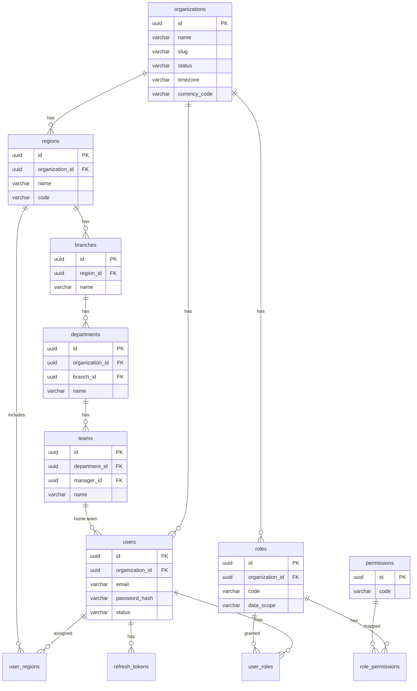
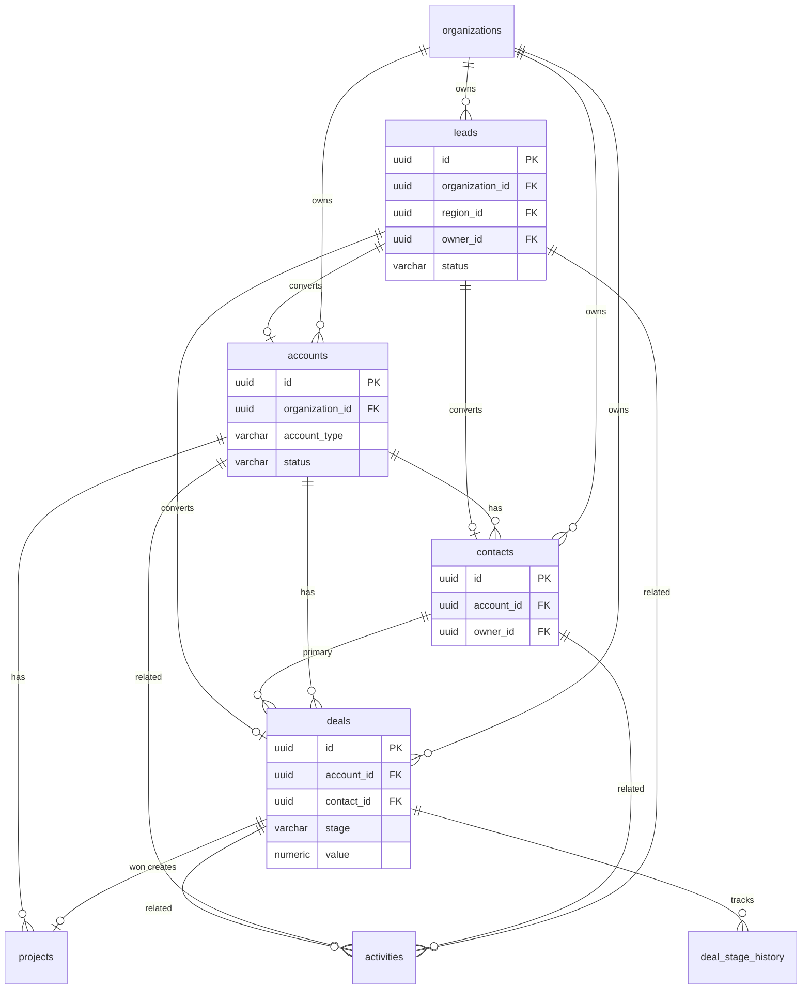
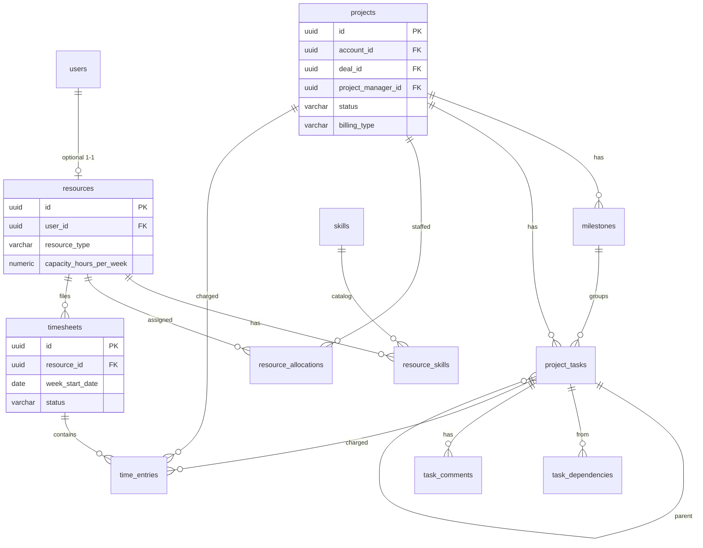
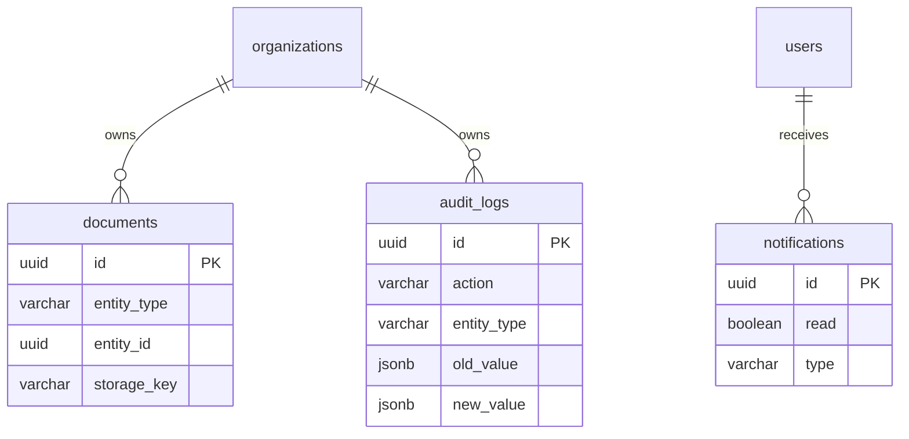

# Database Design

**Database:** PostgreSQL 16  
**Migrations:** Flyway (`backend/src/main/resources/db/migration`)  
**Keys:** UUID primary keys (`uuid`)  
**Timestamps:** `timestamptz` in UTC  
**Soft delete:** `deleted_at timestamptz NULL` on important business tables  
**Tenancy:** `organization_id uuid NOT NULL` on organization-owned tables  

Super Admin / platform tables: `organizations` itself; `users.organization_id` nullable for platform operators only.

V2 tables are specified here for design completeness. **Do not create them in MVP Flyway** unless a later decision says otherwise.

---

## 1. Naming and column standards

| Standard | Rule |
| --- | --- |
| Tables | `snake_case`, plural |
| PK | `id uuid PRIMARY KEY` |
| FKs | `{table_singular}_id` |
| Enums | PostgreSQL `text` + check constraint or app enum; **Assumption:** `varchar` + Flyway check where stable |
| Auditing | `created_at`, `updated_at`, `created_by`, `updated_by` |
| Optimistic lock | `version bigint` on heavily edited aggregates (deals, projects, timesheets) |
| Money | `numeric(18,2)` |
| Rates | `numeric(18,2)` per hour |
| Percents | `numeric(5,2)` |
| Hours | `numeric(8,2)` |

Never store passwords, tokens, or file bytes in business tables. Refresh tokens hashed. Files in object storage.

Indexes (minimum) on: `organization_id`, `region_id`, `owner_id`, `status`, `created_at`, and all FKs used in lists.

Unique constraints are **per organization** where natural keys exist (`(organization_id, email)`).

---

## 2. ERD — identity and organization



**Assumption:** System roles (`SUPER_ADMIN`, …) are seeded per organization as copies **or** global roles with `organization_id NULL`. Custom roles are org-specific. Platform `SUPER_ADMIN` role is global (`organization_id` null). Permissions are global catalog.

---

## 3. ERD — CRM



---

## 4. ERD — projects, resources, time



---

## 5. ERD — platform services



---

## 6. Table definitions — MVP

### 6.1 `organizations`

| Column | Type | Notes |
| --- | --- | --- |
| id | uuid PK | |
| name | varchar(255) not null | |
| slug | varchar(100) unique not null | URL-safe |
| legal_name | varchar(255) | |
| email | varchar(255) | |
| phone | varchar(50) | |
| website | varchar(255) | |
| timezone | varchar(64) not null default `Asia/Kolkata` | |
| locale | varchar(16) default `en-IN` | |
| currency_code | char(3) not null default `INR` | |
| status | varchar(32) not null | `ACTIVE`, `SUSPENDED` |
| deleted_at | timestamptz | |
| created_at, updated_at, created_by, updated_by | | |

### 6.2 `regions`

| Column | Type | Notes |
| --- | --- | --- |
| id | uuid PK | |
| organization_id | uuid not null FK | |
| name | varchar(128) not null | West, Pune as region **or** city-level — **Assumption:** regions are the access-control geography (Pune, Mumbai, …). West/South/North can be a `parent_id` optional self-FK for grouping. |
| parent_id | uuid null FK regions | optional grouping |
| code | varchar(32) not null | unique per org |
| status | varchar(32) not null | `ACTIVE`, `INACTIVE` |
| deleted_at | | |
| audit columns | | |

Unique: `(organization_id, code)`.

### 6.3 `branches`

| Column | Type | Notes |
| --- | --- | --- |
| id | uuid PK | |
| organization_id | uuid not null | denormalized for isolation |
| region_id | uuid not null FK | |
| name | varchar(128) not null | |
| address | text | |
| status | varchar(32) | |
| deleted_at, audit | | |

### 6.4 `departments`

| Column | Type | Notes |
| --- | --- | --- |
| id | uuid PK | |
| organization_id | uuid not null | |
| branch_id | uuid null FK | org-wide dept if null |
| name | varchar(128) not null | |
| status | varchar(32) | |
| deleted_at, audit | | |

### 6.5 `teams`

| Column | Type | Notes |
| --- | --- | --- |
| id | uuid PK | |
| organization_id | uuid not null | |
| department_id | uuid not null FK | |
| manager_id | uuid null FK users | |
| name | varchar(128) not null | |
| deleted_at, audit | | |

### 6.6 `permissions`

Global catalog (no org).

| Column | Type |
| --- | --- |
| id | uuid PK |
| code | varchar(64) unique not null |
| module | varchar(64) not null |
| description | varchar(255) |

### 6.7 `roles`

| Column | Type | Notes |
| --- | --- | --- |
| id | uuid PK | |
| organization_id | uuid null | null = system/platform |
| code | varchar(64) not null | |
| name | varchar(128) not null | |
| data_scope | varchar(32) not null | see permission matrix |
| is_system | boolean not null default false | |
| deleted_at, audit | | |

Unique: `(organization_id, code)` (treat null org as one namespace).

### 6.8 `role_permissions`

| Column | Type |
| --- | --- |
| role_id | uuid PK/FK |
| permission_id | uuid PK/FK |

### 6.9 `users`

| Column | Type | Notes |
| --- | --- | --- |
| id | uuid PK | |
| organization_id | uuid null FK | null Super Admin |
| region_id | uuid null FK | primary region |
| branch_id | uuid null | |
| department_id | uuid null | |
| team_id | uuid null | home team |
| manager_id | uuid null FK users | |
| email | varchar(255) not null | unique per org |
| password_hash | varchar(255) not null | |
| first_name, last_name | varchar(100) not null | |
| phone | varchar(50) | |
| status | varchar(32) not null | `INVITED`, `ACTIVE`, `LOCKED`, `DEACTIVATED` |
| last_login_at | timestamptz | |
| deleted_at, audit | | |

Unique: `(organization_id, email)`.

### 6.10 `user_roles`

| user_id | role_id | PK pair |

### 6.11 `user_regions`

| user_id | region_id | PK pair |

Assigned regions for Regional Admin (and optional extra).

### 6.12 `refresh_tokens`

| Column | Type | Notes |
| --- | --- | --- |
| id | uuid PK | |
| user_id | uuid not null FK | |
| token_hash | varchar(255) not null unique | |
| expires_at | timestamptz not null | |
| revoked_at | timestamptz | |
| created_at | timestamptz | |
| user_agent, ip_address | | no secrets |

### 6.13 `leads`

| Column | Type | Notes |
| --- | --- | --- |
| id | uuid PK | |
| organization_id | uuid not null | |
| region_id | uuid not null | |
| owner_id | uuid not null FK users | |
| first_name, last_name | varchar(100) | |
| company_name | varchar(255) | |
| email, phone, website | | |
| source | varchar(64) | |
| status | varchar(32) not null | see product |
| priority | varchar(16) | `LOW`, `MEDIUM`, `HIGH` |
| industry | varchar(64) | |
| designation | varchar(128) | |
| estimated_value | numeric(18,2) | |
| expected_close_date | date | |
| description | text | |
| converted_account_id | uuid null | |
| converted_contact_id | uuid null | |
| converted_deal_id | uuid null | |
| converted_at | timestamptz | |
| deleted_at, version, audit | | |

Indexes: org+status, org+owner, org+region, org+created_at, org+email.

### 6.14 `accounts`

| Column | Type | Notes |
| --- | --- | --- |
| id | uuid PK | |
| organization_id, region_id, owner_id | uuid not null | |
| name | varchar(255) not null | |
| industry, website, email, phone | | |
| billing_address, shipping_address | text or jsonb | **Assumption:** `jsonb` `{line1,line2,city,state,postalCode,country}` |
| tax_number | varchar(64) | GSTIN-ready |
| status | varchar(32) | `ACTIVE`, `INACTIVE` |
| account_type | varchar(32) | `PROSPECT`, `CUSTOMER`, `PARTNER`, `VENDOR`, `OTHER` |
| description | text | |
| deleted_at, version, audit | | |

### 6.15 `contacts`

| Column | Type | Notes |
| --- | --- | --- |
| id | uuid PK | |
| organization_id, region_id | uuid not null | |
| account_id | uuid not null FK | |
| owner_id | uuid not null | |
| first_name, last_name | not null | |
| email, phone, mobile | | |
| designation, department | varchar | |
| linkedin_url | varchar(255) | |
| status | varchar(32) | |
| notes | text | |
| deleted_at, audit | | |

### 6.16 `deals`

| Column | Type | Notes |
| --- | --- | --- |
| id | uuid PK | |
| organization_id, region_id | not null | |
| account_id | uuid not null | |
| contact_id | uuid null | |
| owner_id | uuid not null | |
| lead_id | uuid null | origin |
| name | varchar(255) not null | |
| stage | varchar(32) not null | |
| value | numeric(18,2) not null default 0 | >= 0 |
| probability | numeric(5,2) not null default 0 | 0–100 |
| expected_close_date | date | |
| source | varchar(64) | |
| description | text | |
| competitor | varchar(255) | |
| won_at, lost_at | timestamptz | |
| lost_reason | varchar(255) | |
| deleted_at, version, audit | | |

### 6.17 `deal_stage_history`

| Column | Type |
| --- | --- |
| id | uuid PK |
| organization_id | uuid not null |
| deal_id | uuid not null |
| from_stage | varchar(32) |
| to_stage | varchar(32) not null |
| changed_by | uuid not null |
| changed_at | timestamptz not null |

### 6.18 `activities`

Polymorphic CRM/project activity (not WBS).

| Column | Type | Notes |
| --- | --- | --- |
| id | uuid PK | |
| organization_id | uuid not null | |
| region_id | uuid null | copied from parent when present |
| type | varchar(32) not null | `TASK`, `CALL`, `MEETING`, `NOTE`, `FOLLOW_UP` |
| subject | varchar(255) not null | |
| description | text | |
| status | varchar(32) not null | `OPEN`, `COMPLETED`, `CANCELLED` |
| priority | varchar(16) | |
| due_date | timestamptz | |
| assigned_to | uuid null FK users | |
| related_entity_type | varchar(32) not null | `LEAD`, `CONTACT`, `ACCOUNT`, `DEAL`, `PROJECT` |
| related_entity_id | uuid not null | |
| completed_at | timestamptz | |
| deleted_at, audit | | |

Index: `(organization_id, related_entity_type, related_entity_id)`.

### 6.19 `projects`

| Column | Type | Notes |
| --- | --- | --- |
| id | uuid PK | |
| organization_id, region_id | not null | |
| account_id | uuid not null | |
| deal_id | uuid null | |
| project_manager_id | uuid not null FK users | |
| name | varchar(255) not null | |
| project_code | varchar(64) not null | unique per org |
| description | text | |
| status | varchar(32) not null | |
| priority | varchar(16) | |
| start_date, end_date | date | end >= start |
| budget | numeric(18,2) | |
| estimated_hours, actual_hours | numeric(12,2) | actual rolled up from time |
| billing_type | varchar(32) not null | |
| deleted_at, version, audit | | |

### 6.20 `milestones`

| Column | Type |
| --- | --- |
| id | uuid PK |
| organization_id | uuid not null |
| project_id | uuid not null |
| name | varchar(255) not null |
| description | text |
| due_date | date |
| status | varchar(32) |
| sort_order | int |
| deleted_at, audit | |

### 6.21 `project_tasks`

| Column | Type | Notes |
| --- | --- | --- |
| id | uuid PK | |
| organization_id | uuid not null | |
| project_id | uuid not null | |
| milestone_id | uuid null | |
| parent_task_id | uuid null | subtask |
| assigned_resource_id | uuid null FK resources | |
| name | varchar(255) not null | |
| description | text | |
| status | varchar(32) not null | |
| priority | varchar(16) | |
| start_date, due_date | date | |
| estimated_hours, actual_hours | numeric(12,2) | |
| completion_percentage | numeric(5,2) not null default 0 | |
| deleted_at, version, audit | | |

### 6.22 `task_dependencies`

| Column | Type | Notes |
| --- | --- | --- |
| id | uuid PK | |
| organization_id | uuid not null | |
| predecessor_task_id | uuid not null | |
| successor_task_id | uuid not null | |
| type | varchar(32) not null default `FINISH_TO_START` | MVP only this type |
| Unique | predecessor + successor | no self-cycle at app level |

### 6.23 `task_comments`

| id | organization_id | task_id | author_id | body | created_at |

### 6.24 `skills`

| Column | Type | Notes |
| --- | --- | --- |
| id | uuid PK | |
| organization_id | uuid not null | org catalog |
| name | varchar(128) not null | unique per org |
| category | varchar(64) | |
| deleted_at | | |

### 6.25 `resources`

| Column | Type | Notes |
| --- | --- | --- |
| id | uuid PK | |
| organization_id, region_id | not null | |
| user_id | uuid null unique | login link |
| employee_code | varchar(64) | unique per org |
| designation | varchar(128) | |
| department_id | uuid null | |
| manager_id | uuid null FK resources or users | **Assumption:** `manager_id` → `users.id` |
| resource_type | varchar(32) not null | `EMPLOYEE`, `CONTRACTOR`, `FREELANCER`, `CONSULTANT` |
| joining_date | date | |
| cost_rate | numeric(18,2) | sensitive |
| billing_rate | numeric(18,2) | |
| capacity_hours_per_week | numeric(8,2) not null default 40 | |
| status | varchar(32) not null | derived + manual override |
| deleted_at, audit | | |

### 6.26 `resource_skills`

| resource_id | skill_id | proficiency | years_of_experience | PK (resource_id, skill_id) |

Proficiency: `BEGINNER`, `INTERMEDIATE`, `ADVANCED`, `EXPERT`.

### 6.27 `resource_allocations`

| Column | Type | Notes |
| --- | --- | --- |
| id | uuid PK | |
| organization_id | uuid not null | |
| project_id | uuid not null | |
| resource_id | uuid not null | |
| start_date, end_date | date not null | |
| allocated_hours | numeric(12,2) | |
| allocation_percentage | numeric(5,2) | |
| role | varchar(128) | on-project role |
| billing_rate, cost_rate | numeric(18,2) | snapshot |
| status | varchar(32) | `PLANNED`, `ACTIVE`, `COMPLETED`, `CANCELLED` |
| deleted_at, audit | | |

Utilization for a period:

- capacity = `capacity_hours_per_week * weeks_in_period` (prorated)
- allocated = sum of overlapping allocation hours (prorated)
- utilization % = allocated / capacity * 100
- `OVER_ALLOCATED` when allocated > capacity

### 6.28 `timesheets`

| Column | Type | Notes |
| --- | --- | --- |
| id | uuid PK | |
| organization_id | uuid not null | |
| resource_id | uuid not null | |
| region_id | uuid not null | denormalized from resource |
| week_start_date | date not null | Monday **Assumption:** ISO week, Monday start |
| status | varchar(32) not null | |
| submitted_at, approved_at | timestamptz | |
| approved_by | uuid null | |
| rejection_reason | text | |
| version | bigint | |
| Unique | (resource_id, week_start_date) where deleted_at is null | |

### 6.29 `time_entries`

| Column | Type | Notes |
| --- | --- | --- |
| id | uuid PK | |
| organization_id | uuid not null | |
| timesheet_id | uuid not null | |
| project_id | uuid not null | |
| task_id | uuid null | |
| work_date | date not null | |
| hours | numeric(8,2) not null | > 0, ≤ 24 |
| description | varchar(500) | |
| billable | boolean not null default true | |
| billing_rate | numeric(18,2) | snapshot |
| deleted_at | | |

### 6.30 `documents`

| Column | Type | Notes |
| --- | --- | --- |
| id | uuid PK | |
| organization_id | uuid not null | |
| entity_type | varchar(32) not null | |
| entity_id | uuid not null | |
| file_name | varchar(255) not null | |
| storage_key | varchar(512) not null | |
| content_type | varchar(128) | |
| size_bytes | bigint | |
| uploaded_by | uuid not null | |
| visibility | varchar(32) default `INTERNAL` | V2 portal uses `CUSTOMER` |
| created_at | | |

### 6.31 `audit_logs`

Append-only. No update/delete from app.

| Column | Type | Notes |
| --- | --- | --- |
| id | uuid PK | |
| organization_id | uuid null | |
| user_id | uuid null | |
| action | varchar(32) not null | `CREATE`, `UPDATE`, `DELETE`, `APPROVE`, `REJECT`, `ASSIGN`, `CONVERT`, `LOGIN`, `LOGOUT` |
| entity_type | varchar(64) not null | |
| entity_id | uuid | |
| old_value | jsonb | scrub secrets |
| new_value | jsonb | scrub secrets |
| ip_address | inet | |
| user_agent | varchar(255) | |
| created_at | timestamptz not null | |

Index: org+created_at, org+entity.

### 6.32 `notifications`

| Column | Type | Notes |
| --- | --- | --- |
| id | uuid PK | |
| organization_id | uuid not null | |
| user_id | uuid not null | |
| type | varchar(64) not null | see product |
| title | varchar(255) not null | |
| message | text not null | |
| entity_type, entity_id | | |
| read | boolean not null default false | |
| created_at | timestamptz not null | |

---

## 7. Table definitions — V2 (design only)

### 7.1 Finance

**`tax_rates`:** org, name, rate, type (`CGST`, `SGST`, `IGST`, `VAT`, `OTHER`), effective dates.

**`invoices`:** org, region, account, project, deal optional, invoice_number unique per org, issue_date, due_date, status, subtotal, tax_total, total, currency, notes.

**`invoice_items`:** invoice, description, quantity, unit_price, tax_rate_id, amount, time_entry_id optional, project_id optional.

**`payments`:** org, invoice, amount, paid_at, method, reference.

**`credit_notes`:** org, invoice, amount, reason, status.

### 7.2 Procurement

**`vendors`:** org, region, name, tax_number, email, phone, account_id optional, status.

**`purchase_orders`:** org, vendor, requester, status, total, currency, needed_by.

**`purchase_order_items`:** po, description, qty, unit_price, amount.

### 7.3 Expenses

**`expenses`:** org, resource, project optional, type (`EMPLOYEE`, `PROJECT`, `TRAVEL`), status, total, incurred_on.

**`expense_items`:** expense, category, amount, tax, description.

### 7.4 Contracts

**`contracts`:** org, account, name, value, start_date, end_date, renewal_date, payment_terms, status.

### 7.5 Workflow

**`workflow_definitions`:** org, name, entity_type, enabled.

**`workflow_triggers`:** workflow, event_type.

**`workflow_conditions`:** trigger, json path / operator / value.

**`workflow_actions`:** trigger, action_type, config jsonb, sort_order.

Prefer an **outbox** table `domain_events` in MVP or V2 for reliable async:

| id | organization_id | event_type | payload jsonb | created_at | processed_at |

MVP may use Spring events only; adding `domain_events` in MVP is a small reliability win. **Assumption:** include `domain_events` in MVP schema as an extension point (listener writes notifications/audit; V2 workflow consumes).

### 7.6 Approval

**`approval_workflows`:** org, target_type, name, active.

**`approval_steps`:** workflow, sort_order, mode (`SEQUENTIAL`, `PARALLEL`), approver_type (`USER`, `ROLE`, `MANAGER`, `DEPARTMENT`, `REGION`), approver_ref.

**`approval_requests`:** org, workflow, target_type, target_id, status.

**`approval_actions`:** request, step, actor_id, action (`APPROVE`, `REJECT`, `COMMENT`), comment, acted_at.

---

## 8. Lifecycle relationships (business, not extra tables)

```text
Lead
  → (convert) Account + Contact + Deal
Deal (WON)
  → Project
Account
  → Contacts, Deals, Projects, Documents, Activities
  → (V2) Invoices, Payments, Contracts
Project
  → Milestones, Tasks, Allocations, Timesheets, Documents, Activities
  → (V2) Invoices, Expenses
Resource
  → Skills, Allocations, Timesheets
Timesheet
  → Time entries (project/task, billable)
  → (V2) Invoice items
```

History is preserved: converted lead keeps FKs to created records; deal keeps `lead_id`; project keeps `deal_id` and `account_id`.

---

## 9. Flyway file plan (MVP)

```text
V1__create_organization_tables.sql
V2__create_users_roles.sql
V3__create_auth_tokens.sql
V4__create_leads.sql
V5__create_accounts_contacts.sql
V6__create_deals.sql
V7__create_activities.sql
V8__create_projects_milestones_tasks.sql
V9__create_resources_skills_allocations.sql
V10__create_timesheets.sql
V11__create_documents_notifications_audit.sql
V12__create_domain_events.sql
V13__seed_permissions_and_demo.sql
```

Never edit applied migrations. Add `V14__...` for changes.

---

## 10. Seed data principles

- One demo organization: “TechEarnest Demo”
- Regions: Pune, Mumbai, Bangalore, Hyderabad, Delhi, Gurgaon (with parent West/South/North)
- Users: one per role, passwords only in local seed (`ChangeMe!123` hashed) — never production
- Emails: `orgadmin@example.com`, `pune.admin@example.com`, etc.
- Sample lead → converted deal → project → allocation → draft/submitted timesheet
- No real customer PII

---

## 11. Query isolation rules

Every repository method for tenant data:

```sql
WHERE organization_id = :orgId
  AND deleted_at IS NULL
  -- plus region/owner/team predicates from AccessGuard
```

Do not rely on the UI to pass the correct `organization_id`.

Hibernate `@Filter` on `organization_id` is defense in depth, not the only control.
